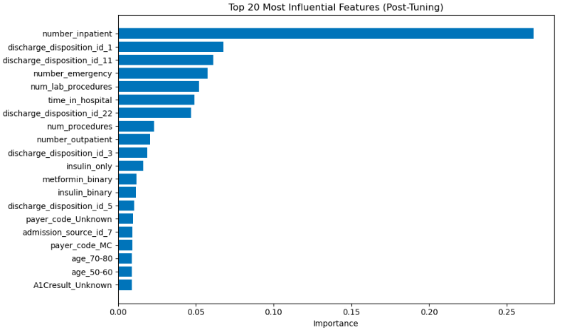
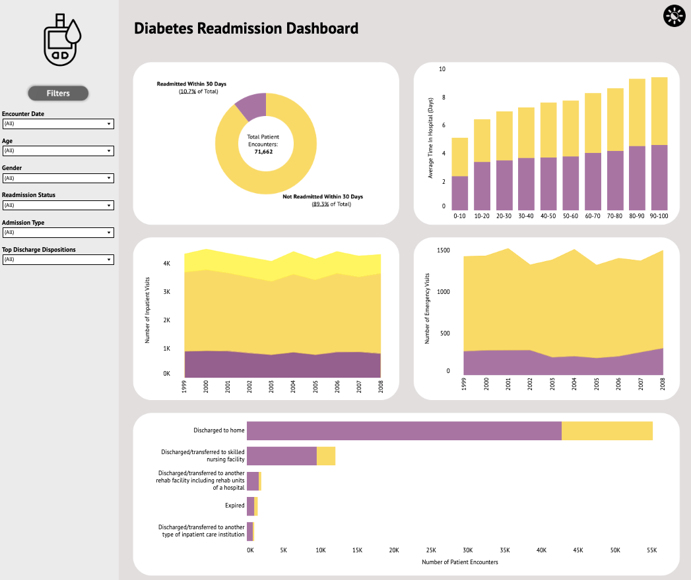

# 30-Day Readmission Predictive Model for Diabetic Patients

<!-- TABLE OF CONTENTS -->

  
Table of Contents

  <ol>
    <li>
      <a href="#about">About</a>
      <ul>
        <li><a href="#primary-goal">Primary Goal</a></li>
        <li><a href="#dataset">Dataset</a></li>
      </ul>
    </li>
    <li>
      <a href="#predictive-modeling-workflow-summary">Predictive Modeling Workflow Summary</a>
      <ul>
        <li><a href="#1-exploratory-data-analysis">1) Exploratory Data Analysis</a></li>
        <li><a href="#2-data-cleaning">2) Data Cleaning</a></li>
        <li>
          <a href="#3-modeling">3) Modeling</a>
          <ul>
            <li><a href="#models-tested">Models Tested</a></li>
          </ul>
        </li>
      </ul>
    </li>
    <li>
      <a href="#findings">Findings</a>
      <ul>
        <li><a href="#best-performing-model">Best Performing Model</a></li>
        <li><a href="#top-20-most-influential-features">Top 20 Most Influential Features</a></li>
      </ul>
    </li>
    <li>
      <a href="#tableau-visualization">Tableau Visualization</a>
      <ul>
        <li><a href="#dashboard-image">Dashboard Image</a></li>
        <li><a href="#analysis-and-insights">Analysis and Insights</a></li>
      </ul>
    </li>
  </ol>

## About
This project is part of a larger project for our 2025 Spring Semester Group Project in Stony Brook's Health Informatics program. My primary contribution included the following:
 * Created a predictive model to identify features most strongly associated with 30-day readmission
 * Co-designed a Tableau dashboard and extracted actionable insights from the data

### Primary Goal
Identify which data elements are most strongly associated with the probability of readmission within 30 days.

### Dataset
[Diabetes 130-US Hospitals (1999-2008)](https://archive.ics.uci.edu/dataset/296/diabetes+130-us+hospitals+for+years+1999-2008)  
 * **Source**: UC Irvine Machine Learning Repository
 * **Note**:
   * All patients have type 2 diabetes in this dataset
   * A copy of the dataset is also included in this repo, located in `datasets/diabetes_data.csv`
   * Some features, such as `admission_type_id`, are numeric codes that map to categorical values. These codes do not have inherent numerical meaning. A mapping file (`datasets/ids_mapping.csv`) is included to interpret these codes.

(<a href="#readme-top">back to top</a>)

## Predictive Modeling Workflow Summary
* Target column: **readmitted**
* Primary metric: **AUC**

### 1) Exploratory Data Analysis
 * The dataset is **highly imbalanced**
   * 90,409 patients (~89%) had **late or no readmissions**  
   * 11,357 patients (~11%) were **readmitted within 30 days**

(<a href="#readme-top">back to top</a>)

### 2) Data Cleaning
1. Dropped unnecessary columns
<table>
  <thead>
    <tr>
      <th>Column(s)</th>
      <th>Reason for Dropping</th>
    </tr>
  </thead>
  <tbody>
    <tr>
      <td><code>encounter_id</code>, <code>patient_nbr</code></td>
      <td>Not relevant and contains PHI</td>
    </tr>
    <tr>
      <td><code>diag_1</code>, <code>diag_2</code>, <code>diag_3</code></td>
      <td>Instructed not to work with these for this project</td>
    </tr>
    <tr>
      <td><code>max_glu_serum, <code>weight</code>, <code>medical_specialty</code></code></td>
      <td>Missing significant percentage of data</td>
    </tr>
    <tr>
      <td><code>num_medications</code>, <code>number_diagnoses</code></td>
      <td>Dropping these ended up improving AUC</td>
    </tr>
  </tbody>
</table>

2. Removed duplicates
3. Unified null-like values by standardizing categorical codes representing unknown or missing data (like 5 = NULL, 6 = Missing) into a single "Unknown" category for consistency
4. Feature Engineering

(<a href="#readme-top">back to top</a>)

### 3. Modeling
1. Split the dataset into **training (70%)**, **validation (15%)**, and **test (15%)** set
2. Over-sampled the imbalanced data
3. Generated nine machine learning models, with **Random Forest** having the best AUC performance
#### Models Tested
<table style="font-size: 20px;">
  <tr>
    <td>Logistic Regression</td>
    <td>Decision Tree</td>
    <td><b>Random Forest</b></td>
  </tr>
  <tr>
    <td>KNN</td>
    <td>Linear SVC</td>
    <td>Gradient Boosting</td>
  </tr>
  <tr>
    <td>Catboost</td>
    <td>Stochastic Gradient Descent</td>
    <td>XGB</td>
  </tr>
</table>

5. Conducted hyperparameter tuning on the **Random Forest** model to further boost AUC

(<a href="#readme-top">back to top</a>)

## Findings
### Best Performing Model
* Random Forest

### Top 20 Most Influential Features

(<a href="#readme-top">back to top</a>)

## Tableau Visualization
### Dashboard Image

### Analysis and Insights

* There were  many emergency inpatient visits and a significant number of patients being readmitted within 30 days, especially those taking diabetes medications. This highlights a possible need for more thorough evaluation and careful post-discharge planning before patients are sent home.

* All patients in the dataset have type 2 diabetes, and metformin is generally the recommended first-line treatment. The high number of emergency admissions among patients **not taking metformin** raises concerns about adherence to clinical guidelines. Possible contributing factors include poor medication adherence, health conditions preventing metformin use, gaps in continuity of care, or problems with insurance. These issues warrant further investigation.

(<a href="#readme-top">back to top</a>)

